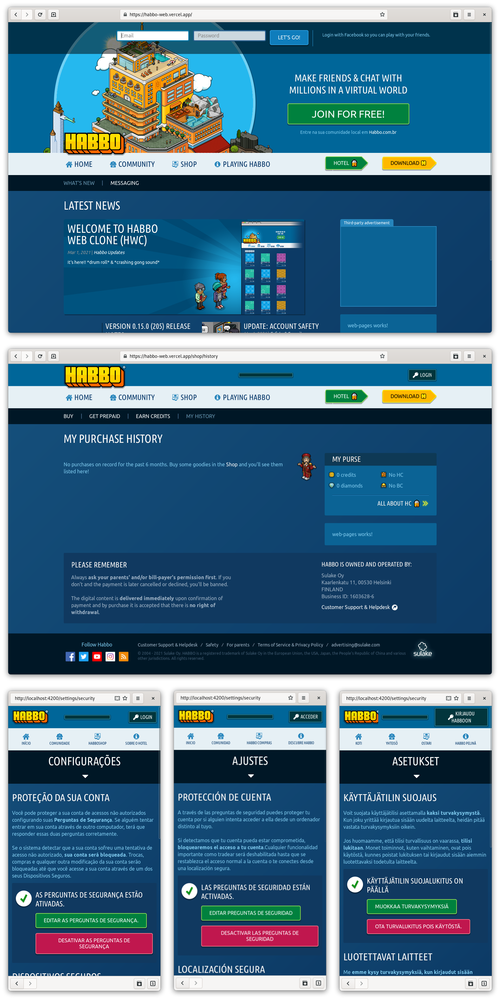

<h1 align="center">
	<br>
 Habbo Web clone
</h1>

<p align="center"><strong>A Habbo Web clone ("working in progress")</strong></p>

<p align="center">The open source Habbo.com clone remade with Angular 2+. All languages ​​included!</p>



## Available hotel location languages

* habbo.de `DE`
* habbo.com `EN`
* habbo.es `ES`
* habbo.fr `FR`
* habbo.fi `FI`
* habbo.it `IT`
* habbo.nl `NL`
* habbo.com.br `PT`
* habbo.com.tr `TR`

To change the language, change the domain to the domain related to the language of your choice in the file `src/environments/environment.ts` in the `localizationSite` property.

```javascript
export const CONFIG = {
  localizationSite: 'com',
};
```

## Description

This project was generated with [Angular CLI](https://github.com/angular/angular-cli) version 11.2.1.

## Development server

Run `ng serve` for a dev server. Navigate to `http://localhost:4200/`. The app will automatically reload if you change any of the source files.

## Code scaffolding

Run `ng generate component component-name` to generate a new component. You can also use `ng generate directive|pipe|service|class|guard|interface|enum|module`.

## Build

Run `ng build` to build the project. The build artifacts will be stored in the `dist/` directory. Use the `--prod` flag for a production build.

## Running unit tests

Run `ng test` to execute the unit tests via [Karma](https://karma-runner.github.io).

## Running end-to-end tests

Run `ng e2e` to execute the end-to-end tests via [Protractor](http://www.protractortest.org/).

## Further help

To get more help on the Angular CLI use `ng help` or go check out the [Angular CLI Overview and Command Reference](https://angular.io/cli) page.
